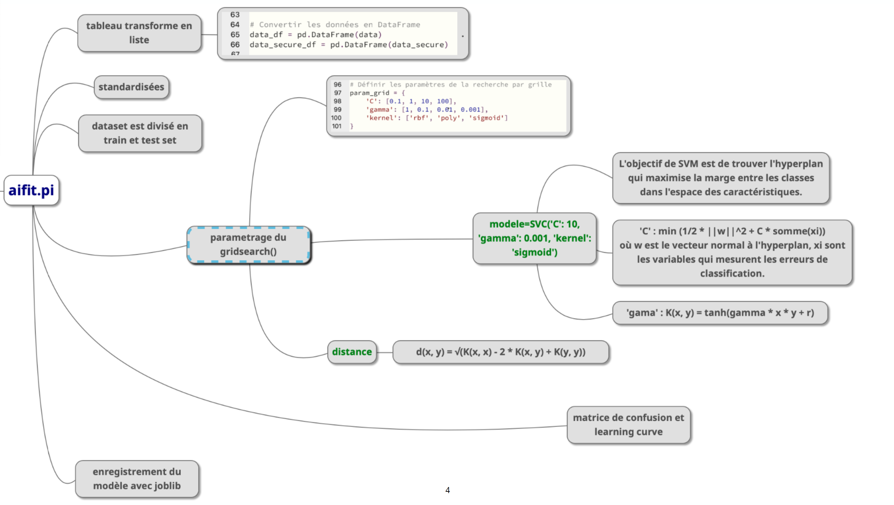
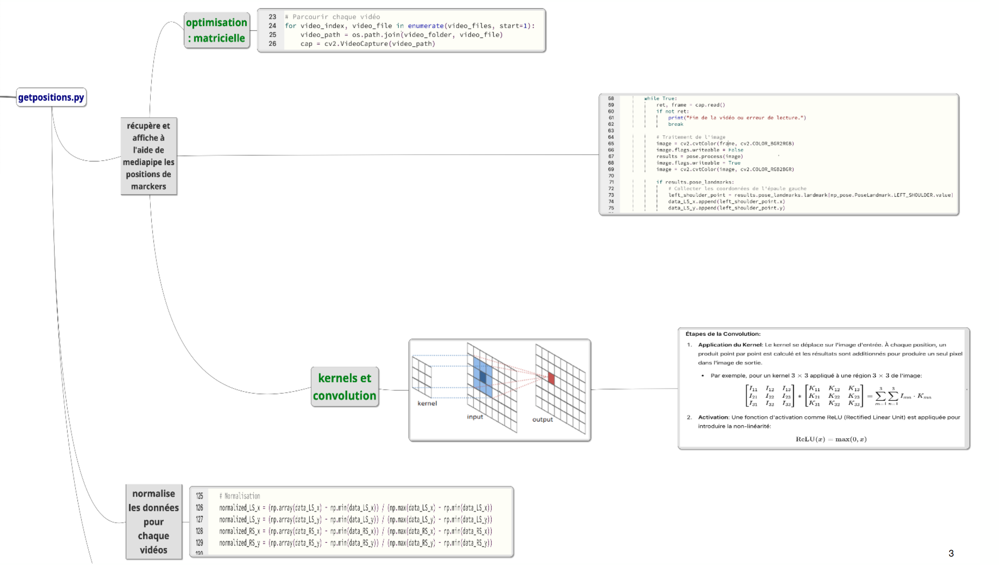

# AI-Coach-Badminton

## Usage and Results 

This AI uses **computer vision** to determine wether a player's playing style is **offensive** or **defensive**, in order to improve his skills.

## Program Sequence

# How to run 

### Attention this program uses non-regular python packages : pandas, sklearn, joblib. 

To be able to **determine the game style of your own video of one stroke** you should use the [realtimepredict.py](realtimepredict.py) program. ( Make sure to change the **video path** when you run it )  
The [realtimepredict.py](realtimepredict.py) program use a **classification model** that have been **trained** before with a dataset.  
Use the **[classification model](classificationmodel/svm_model.joblib) I have made**, or use ur **own dataset** to make yours **with [aifit.py](aifit.py)**. 
Make sure to prepare videos to create the dataset. Each of your videos should be a **player's shot**. **Center the player** with [rogner.py](datapreparation/1-video/rognagevideo.py) and have his **body markers** detected with **[getposition.py](datapreparation/2-cvstable/getpositions.py)**. Then **normalize** all ur cvs data table with **[coupecsv.py](datapreparation/2-cvstable/coupecsv.py)**. 

# How it works

