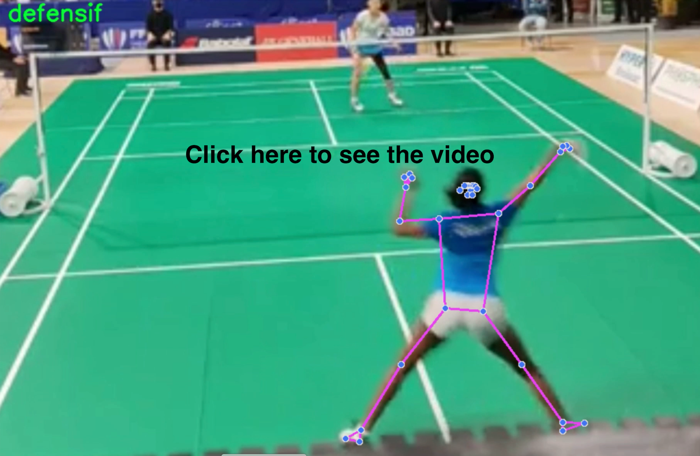
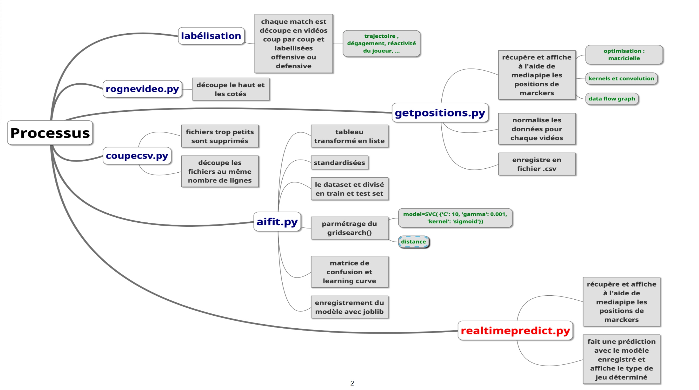

# AI-Coach-Badminton

## Usage and Result 

This AI uses **computer vision** to determine whether a player's playing style is **offensive** or **defensive**, in order to improve the other player's play.

## Program Sequence

# How to run 

### Atention this programe uses non-regular python packages : pandas, sklearn, joblib. 

To be abel to **determine the game style of your own video stroke** you should use the [realtimepredict.py] program. ( Make sure to change for the **correct video path** you have when you run it )  
The realtimepredict.py program use a **classification model** that have been **trained** before with a dataset.  
Use the **[classification model] I have made**, or use ur **own dataset** to make yours **with [aifit.py]**.

# How it works

# files sumery
